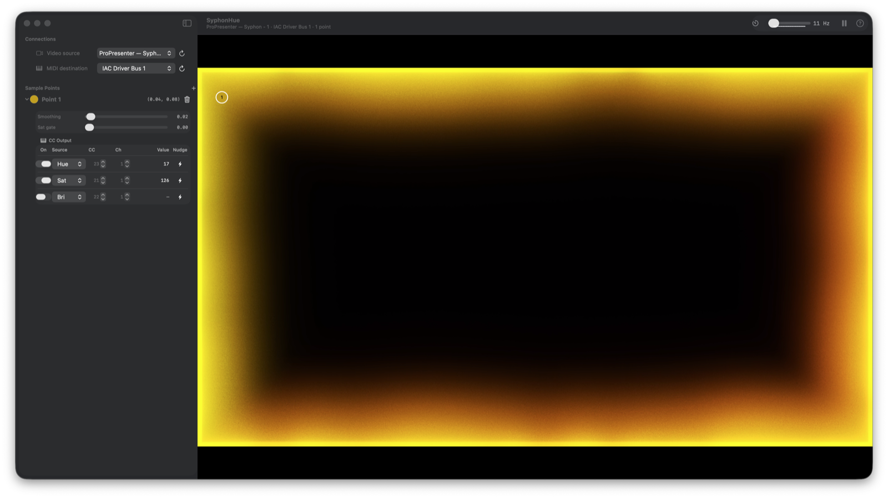

# SyphonHue

macOS app that takes a Syphon video feed, samples colors from points you drop on the preview, and streams those values as MIDI CC messages to any CoreMIDI-aware application — lighting controllers, DAWs, VJ tools, synths, etc.



## Build

```
./build-syphon.sh         # clones + builds Syphon.framework into Frameworks/
xcodegen generate         # produces SyphonHue.xcodeproj
open SyphonHue.xcodeproj  # build & run in Xcode (or: xcodebuild -scheme SyphonHue)
```

## Prerequisites

- macOS 13+
- Xcode 15+ with Command Line Tools
- `xcodegen` (`brew install xcodegen`)

## Use

1. Launch SyphonHue.
2. Pick a Syphon server from the dropdown (any app publishing a Syphon feed will appear).
3. Pick a MIDI destination (use the IAC Driver bus to route to other apps on the same machine).
4. Add sample points; drag them on the preview to choose regions of the video to follow.
5. For each point, enable up to three CC assignments (source = H/S/B/R/G/B, CC#, channel).
6. In the target app, MIDI-learn its control onto the matching CC. Press the sweep button (waveform icon) in SyphonHue to fire a 0→127→0 ramp on demand.

## Per-point tuning

- **Smooth** — exponential smoothing on sampled RGB; reduces flicker on busy video.
- **Sat gate** — when saturation drops below the threshold, hue is held instead of jumping; prevents random hue chasing on grey/black regions.
- **Freeze** (toolbar) — pauses CC output while keeping sampling active; useful when setting cues in the target app.

## Notes

- Values are sampled from a 16×16 pixel area at each point and sent at the rate set by the toolbar slider (default 60 Hz, max 120 Hz).
- Output is 7-bit (0–127) CC per channel. If the target supports a transition/crossfade time on its external controls, setting ~50–100 ms there smooths perceived steps.
- Points, CC assignments, selected Syphon server, MIDI destination, and send rate persist to `~/Library/Application Support/SyphonHue/config.json` and auto-restore on launch.

## Credits

Bundles [Syphon Framework](https://github.com/Syphon/Syphon-Framework) (BSD license).
